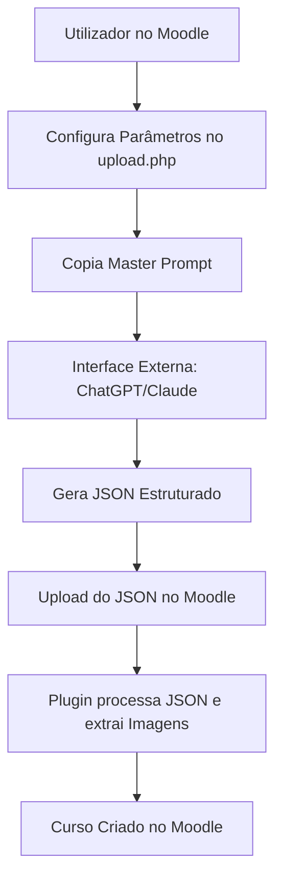
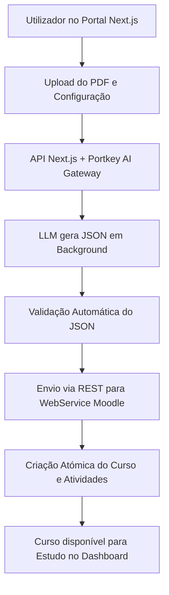

# 🎓 SUPER CONTEXTO: Relatório Final de Projeto (AI LMS MOODLE)

Este documento é a "Fonte de Verdade" definitiva para a redação do relatório académico. Consolida objetivos, requisitos, tecnologias, arquitetura, evolução, detalhes técnicos dos scripts e histórico de desafios superados.

---

## 1. Identidade e Objetivos (Capítulo 1)

### 1.1 Descritivo Geral
O projeto **AI LMS Moodle** é uma solução de vanguarda que utiliza IA Generativa para converter manuais técnicos (PDF) em percursos de aprendizagem corporativa automatizados. Adota uma arquitetura **Headless**, separando a gestão de dados (Moodle 5.1.3) de uma interface moderna e ultra-rápida (Next.js 16).

### 1.2 Objetivos Gerais e Resultados Esperados
*   **Automação Radical:** Redução de **92%** no tempo de criação de conteúdos (de 60 min para < 5 min).
*   **Modernização de UX:** Interface limpa ("Study Mode") que remove o atrito visual do Moodle.
*   **Certificação On-the-Job:** Emissão automática de certificados PDF auditáveis após aprovação.
*   **Escalabilidade:** Suporte para gestão industrial de centenas de cursos simultaneamente.

---

## 2. Requisitos do Projeto (Capítulo 2)

### 2.1 Requisitos de Negócio
*   **Fidelidade Técnica:** Transposição de 100% do conteúdo original (fórmulas, dados, procedimentos) sem alucinações.
*   **Diferenciação de Densidade:** Três níveis pedagógicos: *Resumo Executivo, Profissional e Especialista Técnico*.

### 2.2 Requisitos Funcionais
*   **Geração IA:** Pipeline completo PDF -> Curso via Portkey AI Gateway.
*   **Gestão de Media:** Extração nativa de diagramas via servidor (Poppler/ImageMagick) e ferramenta de reparação (`fix_images.php`).
*   **Dashboard Real:** Métricas agregadas de utilizadores, cursos e certificados consumidas via WebService.

---

## 3. Tecnologias e Ferramentas (Capítulo 3)

### 3.1 Stack Tecnológica (V. Estáveis 2026)
*   **FrontEnd:** Next.js 16.1.6, React 19.2.4, TypeScript 5.7, Tailwind CSS v4, Radix UI.
*   **BackEnd (LMS):** Moodle 5.1.3+ (PHP 8.2), MariaDB 10.11.
*   **Inteligência Artificial:** Google Gemini, Portkey.ai Gateway (SDK 3.0.3).
*   **Flexibilidade de Modelos (Hot-Swap):** O sistema suporta a alternância dinâmica entre diferentes modelos (Gemini, Claude, GPT) e fornecedores diretamente através do Dashboard da Portkey, sem necessidade de alteração de código, utilizando o protocolo de "Config IDs" (prefixo `@`).
*   **Infraestrutura:** Docker & Docker Compose, orquestrado via `bootstrap.sh`.

---

## 4. Evolução e Atividades Desenvolvidas (Capítulo 4)

### 4.1 Evolução do Processo e Comparação de Fluxos
O projeto evoluiu de um processo semi-manual focado no plugin para um ecossistema automatizado.

**Fluxo A: Processo Original (Semi-Manual)**

**Fluxo B: Processo Atual (Automatizado/Headless)**

### 4.2 Arquitetura de Media (Scripts Core)
*   **`image_processor.php` (Motor de Conteúdo):** Classe Moodle responsável por processar placeholders `[[IMG_Pxx_yy]]`. Implementa um algoritmo de **Fuzzy Search** para localizar a imagem correta, trata da renumeração automática de figuras e move os ficheiros para o repositório permanente (`course_assets/`).
*   **`optimize_images.py` (Otimização Industrial):** Script Python para conversão de formatos (PPM/PBM para JPG), **deduplicação via MD5 Hash** e geração de `mapping.json`.
*   **`process_pdf.php` (Ground Truth Engine):** Implementação de um filtro de ruído físico que elimina automaticamente artefatos decorativos (pequenos ficheiros <10KB ou cores sólidas) e devolve uma lista de "Verdade Absoluta" (Ground Truth) de páginas com imagens para a IA.
*   **`get_image.php` (Proxy Inteligente):** Entrega de imagens segura para o FrontEnd com suporte a pesquisas aproximadas.

### 4.3 Inovação: Geração Modular (Map-Reduce Pipeline) e Streaming (SSE)
Para superar o limite de tokens de saída das LLMs e permitir cursos massivos (>80 slides) com alta densidade (>500 palavras/página), foi implementado um pipeline de orquestração modular altamente eficiente:
1.  **Planner:** A IA analisa o PDF e gera um plano estruturado de 3 a 7 módulos.
2.  **Context Slicing:** Otimização técnica que recorta o documento original e envia apenas a secção de texto relevante para a geração de cada módulo individual. Isto traduz-se numa redução de ~70% no consumo de tokens e num aumento tremendo da precisão da IA.
3.  **Orchestrator com Streaming (SSE):** O Backend invoca a IA sequencialmente, processando e emitindo o progresso de cada módulo em tempo real para o FrontEnd através de *Server-Sent Events* (`ReadableStream`), eliminando "telas congeladas" em gerações longas.
4.  **Aggregator & Scrubber:** Sistema de fusão que unifica atividades, re-numera questões sequencialmente e remove imagens inválidas. Inclui um parser JSON "brute-force" imune a ruído, capaz de extrair dados limpos perante as inconsistências estruturais típicas dos modelos Gemini 3.

---

## 5. Resultados e Desafios Superados (Capítulo 5)

### 5.1 Desafios Técnicos Resolvidos (Baseado em LOGS.md)
*   **Gestão de Transações (Bug MDL-83705):** Resolução do erro de "Nested Transactions" no Moodle 5.x via `clear_pending_transactions()`.
*   **Asfixia de IA e Custos (Token Bottleneck):** Transição de geração Single-Shot para Modular (Map-Reduce) combinada com a técnica de *Context Slicing*. Esta combinação reduziu o consumo de contexto em ~70% e garantiu profundidade técnica sem atingir os limites do modelo.
*   **Feedback em Tempo Real (Timeout e UX):** A adoção de SSE (Server-Sent Events) no envio do JSON mitigou perdas de conexão com o Gateway Portkey e permitiu criar uma UI dinâmica no Next.js com *auto-scroll* e progresso contínuo ("A gerar Módulo 2 de 5...").
*   **Resiliência a Anomalias Estruturais (Gemini 3):** Os modelos mais potentes revelaram tendência para adicionar explicações fora do bloco JSON ou aninhar arrays incorretamente. Foi desenvolvido um algoritmo agressivo de *parsing* e recuperação de metadados capaz de inferir a estrutura da IA, mapear arrays automaticamente e usar HTML de resgate se o formato JSON colapsar completamente.
*   **Erradicação de Alucinação Visual:** Implementação de um pipeline determinístico onde o Moodle dita à IA quais as imagens reais disponíveis, eliminando o erro "Imagem não encontrada".
*   **Integridade de Dados no Envio:** Resolução de erros de serialização ("cyclic object value") através de mecanismos de *Deep Copy* e sanitização de objetos JSON complexos.
*   **Refinamento Manual (Human-in-the-loop):** Introdução de ferramentas de edição direta no Preview (FrontEnd) e no `fix_images.php` (Moodle), permitindo o ajuste fino de legendas e conteúdo antes da publicação final.

### 5.2 Metodologia de Teste e Validação
Para garantir a fiabilidade de um sistema que manipula dados críticos de aprendizagem e utiliza IA Generativa, foi adotada uma estratégia de testes em cinco eixos fundamentais:

*   **Testes de Integração de API (Bash & cURL):** Validação do endpoint unificado `create_course_with_content`. Utilização de scripts automatizados para garantir que a orquestração entre Next.js e Moodle ocorre sem perdas de pacotes ou erros de desserialização JSON.
*   **Testes de Stress e Processamento de Media:** Submissão de manuais técnicos com variados níveis de complexidade (ficheiros >20MB, centenas de diagramas e tabelas). O objetivo foi validar a eficiência do motor de extração nativo (`poppler/imagemagick`) e a estabilidade do bypass de upload.
*   **Validação de Fidelidade Pedagógica (Zero Hallucination):** Auditoria manual comparativa entre o conteúdo gerado pela IA e o manual original. Verificação do protocolo "Closed-World" para assegurar que 100% das questões do quiz têm suporte direto no documento fonte.
*   **Testes de Robustez de Base de Dados:** Simulação de falhas de rede durante a geração para validar o mecanismo `clear_pending_transactions`, garantindo que não permanecem transações órfãs ou dados corrompidos no Moodle 5.x.
*   **Validação do Fluxo do Utilizador (Happy Path):** Testes de usabilidade ponta-a-ponta, desde o upload inicial no FrontEnd até à visualização do curso no "Study Mode" e emissão final do certificado PDF.

### 5.3 ROI e Portabilidade
*   **Eficiência Temporal:** Ganho de **92%** na produtividade.
*   **Portabilidade MBZ:** Exportação nativa do Moodle (.mbz) para instâncias empresariais.
*   **Atividades Nativas vs SCORM:** Maior granularidade de dados e flexibilidade Headless.

---

## 6. Trabalho Futuro (Capítulo 6.2)
1.  **Automação Multimodal:** Vision LLMs para validação de imagens.
2.  **Integração H5P:** Atividades interativas geradas por IA.
3.  **Acessibilidade WCAG:** Alt-Text automático.
4.  **RAG para Manuais Massivos:** Processamento de >1000 páginas.

---

## 🤖 Instrução Final para o LLM (Copiar para o Chat)

"Aja como um Engenheiro de Software Sénior e Especialista em EdTech. Com base no SUPER CONTEXTO fornecido, escreva a secção [INSERIR NÚMERO] do meu Relatório Final de Projeto. 
O texto deve ser:
1. **Académico e Formal:** Use terminologia técnica precisa.
2. **Crítico e Analítico:** Explique a racionalidade técnica e os diagramas Mermaid fornecidos.
3. **Estruturado:** Use subtítulos lógicos e destaque o ROI de 92%.
4. **Focado na Evolução:** Destaque a transição para a arquitetura Headless."
